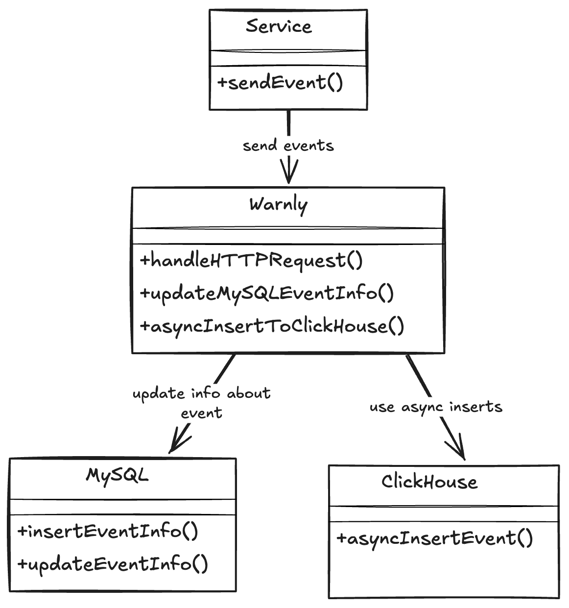

## Project structure

Project architecture follows Ben Johnson's approach from his "WTF Dial" project. 

The `warnly` project organizes code with the following approach:

1. Application domain types go in the package "warnly" — `User`, `Issue`, `Event`, etc.
2. Implementations of the application domain go in other packages —`mysql`, `ch`, `svc`, etc.
3. Everything is tied together in the `cmd` packages—`cmd/warnly`.

### Application domain

The application domain is the collection of types which define what your
application does without defining how it does it. For example, if you were to
describe what Warnly does to a non-technical person, you would describe it in
terms of _Projects_ and _Issues_.

We also include interfaces for managing our application domain data types which
are used as contracts for the underlying implementations. For example, we define
a `warnly.ProjectsService` interface for CRUD (Create/Read/Update/Delete) actions and
MySQL does the actual implementation.

This allows all packages to share a common understanding of what each service
does. We can swap out implementations, or more importantly, we can layer
implementations on top of one another.

### Implementation packages

Implementation packages are used as an adapter between our application domain  and the
technology that we're using to implement the domain. For example,
`project.ProjectService` implements the `warnly.ProjectService` using MySQL and ClickHouse.

Implementation packages generally should not know about one another and should
communicate in terms of the application domain.

These are separated out into the following packages:

- `server`—Implements services over HTTP transport layer.
- `ch`—Implements services on ClickHouse storage layer.
- `mysql`—Implements services on MySQL storage layer.

### Binary packages

The implementation packages are loosely coupled so they need to be wired
together by another package to actually make working software. That's the job
of the `cmd` packages which produce the final binary.

## Development

You can build `warnly` in dev mode locally by cloning the repository, then run:

```sh
make dev
```

```text
cmd/
    warnly/
        main.go         # Entrypoint

internal/
    ch/               # ClickHouse integration (OLAP methods)
    chprometheus/     # Export ClickHouse metrics to Prometheus
    migrator/         # SQL migration (golang-migrate wrapper)
    mysql/            # MySQL integration (OLTP methods)
    server/           # Handler entrypoints
    session/          # User session package
    stdlog/           # Slog convenience wrapper
    svc/              # Service-level logic
    svcotel/          # OpenTelemetry convenience wrapper
    uow/              # Unit of work DB transactions abstraction
    warnly/           # Root package (models, interfaces)
    web/              # HTML templates rendered by templ library
```

## Architecture Overview


